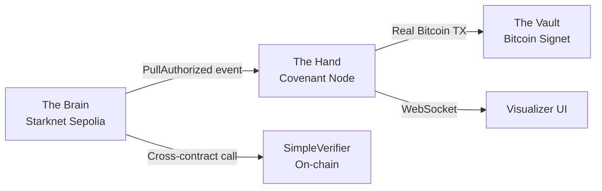

# Covenant-CAD

**Bitcoin OP_CAT Covenant Simulator — Starknet as The Brain, Bitcoin Signet as The Vault :**
**[Demo Video](https://youtu.be/qAxAkQN3QjQ?si=_A5ch3y64kWduek9)**


> A developer sandbox that simulates Bitcoin OP_CAT covenants using Starknet as the enforcement layer and a Python node as the executor. Every transaction is real and verifiable on public testnet explorers — zero cost.

### Live Deployments

| Component | Address | Explorer |
|-----------|---------|----------|
| **CovenantRegistry** | `0x07a54991b...218fd` | [View on Voyager](https://sepolia.voyager.online/contract/0x07a54991b939e30d676343fd6fd46bb405d4c501f6881ae0926bed8559f218fd) |
| **SimpleVerifier** | `0x04524784a...6f4a` | [View on Voyager](https://sepolia.voyager.online/contract/0x04524784a7e74e9b7ecc797576ee72b6c80c0e9d0afec207fe511c8cb8ab6f4a) |
| **Bitcoin Wallet** | `tb1qhhgz0s...47r2n` | [View on mempool.space](https://mempool.space/signet/address/tb1qhhgz0s5xcwjune96tkmqswaqy90mu6flz47r2n) |

---

## Table of Contents

- [Background](#background)
- [How It Works](#how-it-works)
- [Architecture](#architecture)
- [Components](#components)
  - [Cairo Smart Contracts](#cairo-smart-contracts)
  - [Covenant Node](#covenant-node-python)
  - [Bitcoin Wallet](#bitcoin-wallet)
  - [Visualizer UI](#visualizer-ui)
  - [Helper Scripts](#helper-scripts)
- [Project Structure](#project-structure)
- [Getting Started](#getting-started)
- [Configuration Reference](#configuration-reference)
- [Testing](#testing)
- [Security Model](#security-model)
- [Trust Model](#trust-model)
- [API Reference](#api-reference)
- [Verification](#verification)
- [Upgrading to Production Verifier](#upgrading-to-production-verifier)
- [Post-OP_CAT: The Endgame](#post-op_cat-the-endgame)
- [Tech Stack](#tech-stack)
- [References](#references)
- [License](#license)

---

## Background

Bitcoin Script today is too limited to enforce complex spending conditions like "only release funds if a zero-knowledge proof is valid." The proposed **OP_CAT** opcode ([BIP-347](https://github.com/bitcoin/bips/blob/master/bip-0347.mediawiki)) would enable script-level introspection that makes this possible, but it has not been activated yet.

Covenant-CAD bridges this gap by:
- Moving covenant authorization logic to **Cairo on Starknet**, where expressive smart contracts can define and enforce arbitrary spending conditions
- Using a **Python relayer node** that watches Starknet for authorization events and executes corresponding Bitcoin transactions
- Operating entirely on **free testnets** (Starknet Sepolia + Bitcoin Signet) with real, publicly verifiable transactions

The Python node is an explicit **temporary stand-in**. Post-OP_CAT, Bitcoin Script could verify STARK proof commitments directly, eliminating the relayer and making the entire system trustless.

---

## How It Works

The system executes a complete cross-chain covenant flow in 6 steps:

1. A **Cairo smart contract** on Starknet receives a proof and validates it via a real cross-contract call to a deployed on-chain verifier
2. On successful verification, the contract emits a `PullAuthorized` event to the Starknet Sepolia blockchain
3. A **Python node** polling Starknet detects the event in real-time
4. The node constructs a **real P2WPKH SegWit Bitcoin transaction**, signs it with a real ECDSA private key
5. The signed transaction is **broadcast to Bitcoin Signet** via Blockstream's Esplora API
6. The entire flow is visualized in a **real-time dashboard** connected via WebSocket

---

## Architecture

```
┌──────────────────────────────┐     ┌──────────────────────────────┐     ┌────────────────────────┐
│   THE BRAIN                  │     │   THE HAND                   │     │   THE VAULT            │
│   (Starknet Sepolia)         │────>│   (Covenant Node — Python)   │────>│   (Bitcoin Signet)     │
│                              │     │                              │     │                        │
│ CovenantRegistry.cairo       │     │ Watches PullAuthorized       │     │ Real P2WPKH wallet     │
│  ├─ register_covenant()      │     │   events via starknet-py     │     │ Real UTXO spending     │
│  ├─ execute_pull()           │     │ Constructs real SegWit TX    │     │ Broadcast via Esplora  │
│  └─ replay protection        │     │ Signs with real private key  │     │ Viewable on            │
│                              │     │ Broadcasts to Signet         │     │   mempool.space/signet │
│ SimpleVerifier.cairo         │     │                              │     │                        │
│  └─ verify_groth16()         │     │ WebSocket server (port 8080) │     │ FREE: Signet faucet    │
│     (Garaga interface)       │     │ Health endpoint              │     │                        │
│                              │     │ RPC failover                 │     │                        │
│ FREE: Sepolia faucet         │     │ Atomic state persistence     │     │                        │
└──────────────────────────────┘     └──────────────────────────────┘     └────────────────────────┘
                                              │
                                              │ WebSocket (ws://localhost:8080/ws)
                                              ▼
                                     ┌──────────────────────────────┐
                                     │   VISUALIZER UI              │
                                     │   (Single HTML file)         │
                                     │                              │
                                     │ Real-time state machine      │
                                     │ LOCKED → UNLOCKING → UNLOCKED│
                                     │ Live explorer links          │
                                     │ Animated architecture flow   │
                                     └──────────────────────────────┘
```



### Data Flow (Step by Step)

```
1. User invokes execute_pull(vault_id, proof, public_inputs) on Starknet
                    │
2. CovenantRegistry │  execute_pull():
                    │  ├── assert vault exists (UNKNOWN_VAULT)
                    │  ├── assert not spent (VAULT_ALREADY_SPENT)
                    │  ├── IVerifierDispatcher.verify_groth16(proof, public_inputs)
                    │  │   └── SimpleVerifier validates proof structure
                    │  ├── mark vault spent
                    │  └── emit PullAuthorized(vault_id, timestamp)
                    │
3. Python Node      │  starknet_listener() loop:
                    │  ├── get_events(address, keys=[PullAuthorized selector])
                    │  ├── deduplicate by transaction hash
                    │  └── execute_bitcoin_logic(vault_id, starknet_tx_hash)
                    │
4. Bitcoin Wallet   │  SignetWallet.create_transaction():
                    │  ├── fetch UTXOs from Esplora API
                    │  ├── select inputs, build P2WPKH outputs
                    │  ├── SegWit sign (SIGVERSION_WITNESS_V0)
                    │  └── broadcast via Esplora (fallback: mempool.space)
                    │
5. UI               │  WebSocket receives success message:
                    │  └── displays TXID + clickable explorer link
```

---

## Components

### Cairo Smart Contracts

Two contracts deployed on Starknet Sepolia, built with **Cairo 2.15** (edition 2024_07) and compiled via **Scarb 2.15.2**.

#### CovenantRegistry ([contracts/src/covenant_registry.cairo](contracts/src/covenant_registry.cairo))

The core contract that manages vault lifecycle and coordinates verification.

**Storage:**

| Field | Type | Purpose |
|-------|------|---------|
| `covenants` | `Map<felt252, felt252>` | Maps vault_id to conditions_hash |
| `authorized_pulls` | `Map<felt252, bool>` | Tracks spent vaults (replay protection) |
| `verifier_address` | `ContractAddress` | Address of linked verifier contract |
| `owner` | `ContractAddress` | Deployer address (set in constructor) |

**Functions:**

| Function | Type | Description |
|----------|------|-------------|
| `register_covenant(vault_id, conditions_hash)` | Write | Registers a new vault. Reverts with `VAULT_ALREADY_EXISTS` if vault_id is taken, `INVALID_CONDITIONS` if conditions_hash is zero. Emits `CovenantRegistered` event. |
| `execute_pull(vault_id, proof, public_inputs)` | Write | The core function. Checks vault exists (`UNKNOWN_VAULT`), checks not spent (`VAULT_ALREADY_SPENT`), makes cross-contract call to verifier (`PROOF_VERIFICATION_FAILED`), marks vault spent, emits `PullAuthorized` event. |
| `get_covenant(vault_id)` | Read | Returns the conditions_hash for a vault (0 if unregistered). |
| `is_vault_spent(vault_id)` | Read | Returns whether a vault has been spent. |
| `get_verifier_address()` | Read | Returns the linked verifier contract address. |

**Events:**

| Event | Fields | Emitted When |
|-------|--------|-------------|
| `CovenantRegistered` | `vault_id`, `conditions_hash`, `registrar` | A new vault is registered |
| `PullAuthorized` | `vault_id`, `timestamp` | A covenant is successfully executed (proof verified, vault spent) |

#### SimpleVerifier ([contracts/src/simple_verifier.cairo](contracts/src/simple_verifier.cairo))

A Garaga-interface-compatible verifier that validates proof structure. Implements the same `verify_groth16(proof, public_inputs) -> bool` interface that [Garaga's Groth16 verifier](https://garaga.gitbook.io/garaga) exposes, making it a drop-in replacement.

**What it does:**
- Validates proof array is non-empty (`EMPTY_PROOF`)
- Validates at least 1 public input exists (`EMPTY_PUBLIC_INPUTS`)
- Increments an on-chain `verification_count` (real state mutation)
- Emits `ProofVerified` event with proof_length, public_inputs_length, and timestamp
- Returns `true` for valid-structured proofs

**What it doesn't do:**
- Full Groth16 elliptic curve pairing checks (that's what Garaga does)

The verifier is a separate deployed contract called via cross-contract dispatch (`IVerifierDispatcher`), not an inline function. This means upgrading to a real ZK verifier is a one-line constructor argument change.

---

### Covenant Node (Python)

The off-chain relayer that bridges Starknet events to Bitcoin transactions.

| File | Purpose |
|------|---------|
| [covenant_node.py](node/covenant_node.py) | Main event loop — aiohttp WebSocket server, Starknet event polling, Bitcoin TX execution, health endpoint, persistence, RPC failover |
| [bitcoin_wallet.py](node/bitcoin_wallet.py) | `SignetWallet` class — key management, UTXO fetching, P2WPKH SegWit transaction construction, signing, broadcast |
| [config.py](node/config.py) | Centralized configuration loaded from `.env` with defaults |

**Capabilities:**

| Feature | Details |
|---------|---------|
| Event polling | Polls Starknet Sepolia via `get_events()` every 3 seconds (configurable) |
| Event filtering | Uses `get_selector_from_name("PullAuthorized")` to compute the event key |
| Deduplication | Tracks processed transaction hashes to prevent duplicate processing |
| Persistence | Atomic JSON writes (`write .tmp` then `os.replace`) — survives crash/restart |
| RPC failover | Toggles between primary (Cartridge) and fallback (Lava) on RPC errors |
| WebSocket | Pushes real-time state updates to connected UI clients |
| Health endpoint | `GET /health` returns JSON with wallet balance, processed count, mode |
| Offline mode | `DEMO_FORCE=1` skips Starknet polling and auto-triggers a real Bitcoin TX after 5 seconds |

**Startup sequence:**
1. Validates `.env` config (exits if registry address is missing)
2. Loads or creates Bitcoin Signet wallet from JSON file
3. Computes `PullAuthorized` event selector
4. Loads persisted state (last block, processed tx hashes)
5. Starts aiohttp server on port 8080 (`/ws` + `/health`)
6. Enters event polling loop (or demo mode)

---

### Bitcoin Wallet

The `SignetWallet` class in [bitcoin_wallet.py](node/bitcoin_wallet.py) handles all Bitcoin operations.

**Key generation:**
- Generates 32 bytes of entropy via `os.urandom(32)`
- Derives compressed public key via `CBitcoinSecret.from_secret_bytes()`
- Derives P2WPKH (SegWit v0) address: `Hash160(pubkey)` → bech32 `tb1q...`
- Persists private key as WIF-encoded JSON

**Transaction construction (`create_transaction()`):**
1. Fetches real UTXOs from Blockstream Esplora API (`/address/{addr}/utxo`)
2. Selects UTXOs until total input >= amount + fee
3. Builds `CMutableTxIn` for each selected UTXO
4. Builds outputs: payment to destination + change to self (if > 546 sats dust threshold)
5. SegWit signing for each input:
   - Constructs P2WPKH script code (`OP_DUP OP_HASH160 <pubkeyhash> OP_EQUALVERIFY OP_CHECKSIG`)
   - Computes `SignatureHash` with `sigversion=1` (SIGVERSION_WITNESS_V0)
   - Signs with ECDSA, appends `SIGHASH_ALL` byte
   - Builds witness stack: `[signature, compressed_pubkey]`
6. Assigns `CTxWitness` to transaction and serializes

**Broadcast:**
- Primary: `POST` raw hex to `blockstream.info/signet/api/tx`
- Fallback: `POST` to `mempool.space/signet/api/tx`
- Returns TXID on success

---

### Visualizer UI

A single HTML file ([ui/index.html](ui/index.html)) with no build step and no framework dependencies.

**Design:**
- Typography: IBM Plex Mono (headings), IBM Plex Sans (body), Fira Code (addresses/hashes) via Google Fonts
- Color palette: Near-black backgrounds (#06080c → #1a2234), Bitcoin Orange (#f7931a), Starknet Blue (#29aafd)
- Layout: CSS Grid with 4 panels — Architecture Flow, Vault State, Network Details, Event Log
- Sharp corners (zero border-radius), noise texture backgrounds

**State machine:** `LOCKED → UNLOCKING → UNLOCKED | ERROR`

**WebSocket protocol:**

| Message type | Direction | Payload |
|-------------|-----------|---------|
| `status` | Server → Client | Initial connection: mode, wallet_address, balance, explorer links |
| `unlocking` | Server → Client | Vault is being processed: vault_id, starknet_tx, starknet_url |
| `success` | Server → Client | Bitcoin TX broadcast: tx_hash, explorer_url, amount_sats, destination |
| `error` | Server → Client | Error occurred: vault_id, error message, fund_url |

**Features:**
- WebSocket auto-reconnect on disconnect
- Animated architecture flow during UNLOCKING state
- Inline SVG icons (no external icon dependencies)
- Address truncation with copy-to-clipboard
- Clickable explorer links for both Starknet and Bitcoin transactions
- Responsive layout for different screen sizes
- Scale entrance animation on UNLOCKED state
- Balance dot pulse animation on value change

---

### Helper Scripts

| Script | Purpose | Usage |
|--------|---------|-------|
| [setup_wallet.py](scripts/setup_wallet.py) | Generate a new Bitcoin Signet wallet | `python3 scripts/setup_wallet.py` |
| [check_balance.py](scripts/check_balance.py) | Display wallet balance and UTXO count | `python3 scripts/check_balance.py` |
| [register_vault.py](scripts/register_vault.py) | Register a covenant vault on Starknet via starknet-py | Requires account address + private key |
| [trigger_pull.py](scripts/trigger_pull.py) | Call `execute_pull` to fire the PullAuthorized event | Requires account address + private key |

---

## Project Structure

```
covenant-cad/
├── contracts/                       # Cairo smart contracts
│   ├── Scarb.toml                   # Package config (edition 2024_07, snforge_std 0.56.0)
│   ├── src/
│   │   ├── lib.cairo                # Module declarations (pub mod)
│   │   ├── covenant_registry.cairo  # Registry + verifier dispatch + events
│   │   └── simple_verifier.cairo    # Garaga-interface verifier stub
│   └── tests/
│       └── test_contracts.cairo     # 5 integration tests (snforge)
├── node/                            # Python covenant node
│   ├── covenant_node.py             # Event listener + Bitcoin TX builder + WebSocket
│   ├── bitcoin_wallet.py            # SignetWallet — P2WPKH transactions
│   ├── config.py                    # Centralized .env config loader
│   ├── requirements.txt             # Python dependencies
│   ├── .env.example                 # Template config
│   └── .env                         # Actual config (gitignored)
├── ui/
│   └── index.html                   # Single-file real-time dashboard
├── scripts/
│   ├── setup_wallet.py              # Generate Bitcoin Signet wallet
│   ├── check_balance.py             # Check wallet balance
│   ├── register_vault.py            # Register vault on Starknet
│   └── trigger_pull.py              # Trigger execute_pull
├── docs/
│   └── architecture.md              # Trust model & architecture documentation
├── plan.md                          # Original design specification
├── .gitignore
└── README.md
```

---

## Getting Started

### Prerequisites

- **Python 3.9+**
- **Scarb 2.15.2+** — Cairo package manager ([install guide](https://docs.starknet.io/guides/quickstart/environment-setup/))
- **Starknet Foundry** — sncast (deployment) + snforge (testing) ([install guide](https://foundry-rs.github.io/starknet-foundry/))

### 1. Install Starknet Tools

```bash
curl --proto '=https' --tlsv1.2 -sSf https://sh.starkup.sh | sh
source ~/.bashrc 2>/dev/null || source ~/.zshrc 2>/dev/null
```

Verify:

```bash
scarb --version    # Should show 2.15.2+
sncast --version   # Should show 0.56.0+
snforge --version  # Should show 0.56.0+
```

### 2. Install Python Dependencies

```bash
cd node
pip install -r requirements.txt
cd ..
```

Dependencies: `aiohttp>=3.9.0`, `starknet-py>=0.28.0`, `python-bitcoinlib>=0.12.2`, `requests>=2.31.0`, `python-dotenv>=1.0.0`

### 3. Build Contracts

```bash
cd contracts
scarb build
cd ..
```

Produces 2 contract artifacts in `contracts/target/dev/`:
- `covenant_cad_CovenantRegistry.contract_class.json`
- `covenant_cad_SimpleVerifier.contract_class.json`

### 4. Run Tests

```bash
cd contracts
snforge test
```

Expected output: `Tests: 5 passed, 0 failed, 0 ignored, 0 filtered out`

### 5. Create & Fund Starknet Account

```bash
sncast account create --name covenant_dev --network sepolia
```

Fund at [starknet-faucet.vercel.app](https://starknet-faucet.vercel.app/) (free), then deploy:

```bash
sncast account deploy --name covenant_dev --network sepolia
```

### 6. Deploy Contracts

```bash
cd contracts

# Declare + Deploy SimpleVerifier
sncast --account covenant_dev declare --contract-name SimpleVerifier --network sepolia
# Wait ~15 seconds for block confirmation
sncast --account covenant_dev deploy --class-hash <VERIFIER_CLASS_HASH> --network sepolia

# Declare + Deploy CovenantRegistry (pass verifier address as constructor arg)
sncast --account covenant_dev declare --contract-name CovenantRegistry --network sepolia
# Wait ~15 seconds for block confirmation
sncast --account covenant_dev deploy --class-hash <REGISTRY_CLASS_HASH> \
    --constructor-calldata <VERIFIER_ADDRESS> --network sepolia

cd ..
```

### 7. Configure Environment

```bash
cp node/.env.example node/.env
```

Edit `node/.env` with your deployed contract addresses:

```env
REGISTRY_CONTRACT_ADDRESS=0x07a5...
VERIFIER_CONTRACT_ADDRESS=0x0452...
```

### 8. Create & Fund Bitcoin Wallet

```bash
cd scripts
python3 setup_wallet.py
cd ..
```

Fund the printed address at [signetfaucet.com](https://signetfaucet.com/) (free). You need at least 2000 sats.

Verify:

```bash
cd scripts && python3 check_balance.py
```

### 9. Register a Vault

```bash
sncast --account covenant_dev invoke \
    --contract-address <REGISTRY_ADDRESS> \
    --function register_covenant \
    --calldata 1 0xCAFE \
    --network sepolia
```

This registers vault_id=1 with conditions_hash=0xCAFE. Each vault_id can only be registered once.

### 10. Start the System

```bash
# Terminal 1: Covenant Node
cd node && python3 covenant_node.py

# Terminal 2: UI Server
cd ui && python3 -m http.server 8000
```

Open [http://localhost:8000](http://localhost:8000) — UI should show LIVE status and wallet balance.

### 11. Trigger a Covenant Execution

```bash
sncast --account covenant_dev invoke \
    --contract-address <REGISTRY_ADDRESS> \
    --function execute_pull \
    --calldata 1 3 42 123 456 1 0xCAFE \
    --network sepolia
```

**Calldata format** — Cairo serializes arrays as `[length, ...elements]`:

| Value | Meaning |
|-------|---------|
| `1` | vault_id |
| `3` | proof array length |
| `42 123 456` | proof elements |
| `1` | public_inputs array length |
| `0xCAFE` | public_inputs[0] |

Watch the node detect the event, construct a Bitcoin transaction, and broadcast it. The UI transitions LOCKED → UNLOCKING → UNLOCKED with a clickable mempool.space link.

### Offline Mode

Set `DEMO_FORCE=1` in `node/.env` to skip Starknet event polling and auto-trigger a real Bitcoin Signet transaction after 5 seconds. The transaction is still real and broadcast to Signet — only the Starknet trigger is skipped.

---

## Configuration Reference

All configuration is in `node/.env` (loaded by [config.py](node/config.py)):

| Variable | Default | Description |
|----------|---------|-------------|
| `STARKNET_RPC_PRIMARY` | `https://api.cartridge.gg/x/starknet/sepolia` | Primary Starknet Sepolia RPC endpoint |
| `STARKNET_RPC_FALLBACK` | `https://rpc.starknet-testnet.lava.build` | Fallback RPC (used on primary failure) |
| `REGISTRY_CONTRACT_ADDRESS` | *(required)* | Deployed CovenantRegistry contract address |
| `VERIFIER_CONTRACT_ADDRESS` | *(optional)* | Deployed SimpleVerifier contract address |
| `WALLET_FILE` | `covenant_wallet.json` | Path to Bitcoin wallet JSON file |
| `VAULT_DESTINATION_ADDRESS` | *(empty = send to self)* | Bitcoin address for covenant payouts |
| `COVENANT_PAYOUT_SATS` | `1000` | Amount to send per covenant execution (satoshis) |
| `TARGET_VAULT_ID` | `1` | Vault ID the node watches for |
| `WS_PORT` | `8080` | WebSocket + HTTP server port |
| `POLL_INTERVAL_SECS` | `3` | Starknet event polling interval (seconds) |
| `DEMO_FORCE` | `0` | Set to `1` to skip Starknet and auto-trigger |

---

## Testing

### Cairo Contract Tests

5 integration tests using [Starknet Foundry](https://foundry-rs.github.io/starknet-foundry/) (snforge 0.56.0):

```bash
cd contracts && snforge test
```

| Test | What It Verifies |
|------|-----------------|
| `test_register_and_read` | Register vault, read back conditions_hash, verify not spent |
| `test_unknown_vault_fails` | `execute_pull` on unregistered vault reverts with `UNKNOWN_VAULT` |
| `test_replay_protection` | Second `execute_pull` on same vault reverts with `VAULT_ALREADY_SPENT` |
| `test_duplicate_registration_fails` | Re-registering existing vault_id reverts with `VAULT_ALREADY_EXISTS` |
| `test_zero_conditions_fails` | Registering with conditions_hash=0 reverts with `INVALID_CONDITIONS` |

Tests deploy both SimpleVerifier and CovenantRegistry in-test via `declare` + `deploy`, then exercise the full cross-contract flow.

### Manual Verification

```bash
# Check node health
curl http://localhost:8080/health

# Check wallet balance
cd scripts && python3 check_balance.py

# Verify replay protection (second call should revert)
sncast --account covenant_dev invoke \
    --contract-address <REGISTRY_ADDRESS> \
    --function execute_pull \
    --calldata 1 3 42 123 456 1 0xCAFE \
    --network sepolia
# Expected: Transaction reverts with VAULT_ALREADY_SPENT
```

---

## Security Model

### On-Chain Security (Cairo Contracts)

| Invariant | Enforcement | Error Code |
|-----------|-------------|------------|
| Vault must exist before spending | `covenants[vault_id] != 0` check | `UNKNOWN_VAULT` |
| Each vault can only be spent once | `authorized_pulls[vault_id]` boolean flag | `VAULT_ALREADY_SPENT` |
| Vault IDs cannot be re-registered | `covenants[vault_id] == 0` check on registration | `VAULT_ALREADY_EXISTS` |
| Conditions hash must be meaningful | `conditions_hash != 0` check | `INVALID_CONDITIONS` |
| Proof must be non-empty | Verifier checks `proof.len() > 0` | `EMPTY_PROOF` |
| Public inputs must be non-empty | Verifier checks `public_inputs.len() > 0` | `EMPTY_PUBLIC_INPUTS` |
| Verification is a real contract call | `IVerifierDispatcher` cross-contract dispatch | `PROOF_VERIFICATION_FAILED` |

### Off-Chain Security (Node)

| Feature | Implementation |
|---------|---------------|
| Crash recovery | Atomic JSON persistence — writes to `.tmp` file, then `os.replace()` |
| Event deduplication | Tracks processed Starknet TX hashes in a set |
| RPC resilience | Automatic failover between primary and fallback Starknet RPCs |
| API resilience | Bitcoin broadcast falls back from Blockstream Esplora to mempool.space |
| Dust protection | Change outputs below 546 sats (Bitcoin dust limit) are dropped |
| Balance validation | Checks wallet has sufficient funds before constructing transaction |
| Config validation | Exits on startup if registry contract address is missing |

---

## Trust Model

| Component | Role | Trust Level |
|-----------|------|-------------|
| **The Brain** (Starknet) | Validates covenant conditions via on-chain verifier, emits authorization events, enforces replay protection | Trustless (on-chain) |
| **The Hand** (Python Node) | Watches events, constructs + signs + broadcasts Bitcoin transactions | **Trusted relayer** (temporary) |
| **The Vault** (Bitcoin Signet) | Holds real testnet sBTC, transactions publicly verifiable | Trustless (on-chain) |

> **Why the trusted relayer?** Bitcoin cannot currently verify STARK proofs in Script. The Python node is a temporary stand-in. Post-OP_CAT, Bitcoin Script gains the ability to verify proof commitments directly — at which point the node is eliminated entirely and the system becomes fully trustless.

---

## API Reference

### Health Endpoint

```
GET http://localhost:8080/health
```

Response:
```json
{
  "status": "healthy",
  "mode": "LIVE_SIGNET",
  "last_block": 123456,
  "processed_count": 3,
  "bitcoin_wallet": "tb1q...",
  "bitcoin_balance_sats": 502408,
  "starknet_contract": "0x07a5...",
  "network": {
    "starknet": "Sepolia (testnet)",
    "bitcoin": "Signet (testnet)"
  }
}
```

### WebSocket

```
ws://localhost:8080/ws
```

On connection, the server sends an initial `status` message with wallet info and explorer links. Subsequent messages are pushed as covenant events occur (`unlocking`, `success`, `error`).

---

## Deployed Contracts & Wallet

Live instances currently deployed and verifiable:

| Component | Address | Explorer |
|-----------|---------|----------|
| **CovenantRegistry** | `0x07a54991b939e30d676343fd6fd46bb405d4c501f6881ae0926bed8559f218fd` | [View on Voyager](https://sepolia.voyager.online/contract/0x07a54991b939e30d676343fd6fd46bb405d4c501f6881ae0926bed8559f218fd) |
| **SimpleVerifier** | `0x04524784a7e74e9b7ecc797576ee72b6c80c0e9d0afec207fe511c8cb8ab6f4a` | [View on Voyager](https://sepolia.voyager.online/contract/0x04524784a7e74e9b7ecc797576ee72b6c80c0e9d0afec207fe511c8cb8ab6f4a) |
| **Bitcoin Wallet** | `tb1qhhgz0s5xcwjune96tkmqswaqy90mu6flz47r2n` | [View on mempool.space](https://mempool.space/signet/address/tb1qhhgz0s5xcwjune96tkmqswaqy90mu6flz47r2n) |

---

## Verification

Every transaction is real and independently verifiable:

- **Starknet contracts**: View events and transactions on [sepolia.voyager.online](https://sepolia.voyager.online/)
- **Bitcoin transactions**: View on [mempool.space/signet](https://mempool.space/signet/)
- **Replay protection**: Call `execute_pull` twice on the same vault — second call reverts with `VAULT_ALREADY_SPENT`
- **Proof validation**: Call `execute_pull` with an empty proof array — reverts with `EMPTY_PROOF`
- **Health check**: `curl http://localhost:8080/health` returns wallet balance, processed count, and mode

---

## Upgrading to Production Verifier

The SimpleVerifier implements the exact same interface as [Garaga's Groth16 verifier](https://garaga.gitbook.io/garaga):

```cairo
fn verify_groth16(
    ref self: TContractState,
    proof: Array<felt252>,
    public_inputs: Array<felt252>
) -> bool;
```

To upgrade to real ZK proof verification:

1. Deploy Garaga's Groth16 verifier contract on Starknet Sepolia
2. Redeploy CovenantRegistry with the Garaga verifier address as the constructor argument
3. No code changes needed — the interface is identical

```bash
sncast --account covenant_dev deploy \
    --class-hash <REGISTRY_CLASS_HASH> \
    --constructor-calldata <GARAGA_VERIFIER_ADDRESS> \
    --network sepolia
```

Resources:
- [Garaga documentation](https://garaga.gitbook.io/garaga)
- [Scaffold-Garaga](https://github.com/KevinSheeranxyj/scaffold-garaga)

---

## Post-OP_CAT: The Endgame

When Bitcoin activates OP_CAT ([BIP-347](https://github.com/bitcoin/bips/blob/master/bip-0347.mediawiki)):

```
TODAY (Covenant-CAD):
  Starknet verifies proof → Python node relays → Bitcoin moves
  [Trusted relayer required]

POST-OP_CAT:
  Starknet verifies proof → Bitcoin Script enforces commitment directly
  [Fully trustless — no relayer]
```

1. **The Python Node is eliminated entirely** — no off-chain component needed
2. **Bitcoin Script verifies STARK proof commitments** via OP_CAT-enabled introspection
3. **The Starknet verifier output is committed to Bitcoin Script** — the transaction structure must match what the verifier approved
4. **The system becomes fully trustless** — covenant enforcement is entirely on-chain across both networks

OP_CAT doesn't verify proofs directly in Script — it enables script-level introspection so that scripts can enforce that a transaction's structure corresponds to what a STARK verifier approved.

---

## Tech Stack

| Component | Technology | Version |
|-----------|-----------|---------|
| Smart Contracts | Cairo on Starknet Sepolia | Cairo 2.15, Scarb 2.15.2 |
| On-chain Verifier | Garaga-interface-compatible | Cross-contract dispatch |
| Contract Testing | Starknet Foundry (snforge) | 0.56.0 |
| Contract Deployment | Starknet Foundry (sncast) | 0.56.0 |
| Covenant Node | Python | 3.9+ |
| Starknet SDK | starknet-py | 0.28.1 |
| Bitcoin Library | python-bitcoinlib | 0.12.2 |
| WebSocket Server | aiohttp | 3.9+ |
| Bitcoin Network | Signet via Blockstream Esplora API | No auth required |
| Bitcoin TX Type | P2WPKH (SegWit v0) | BIP-141 |
| UI | Single HTML file (vanilla JS + WebSocket) | No framework |
| Cost | Starknet Sepolia + Bitcoin Signet faucets | Zero |

---

## References

- [Bitcoin OP_CAT BIP (BIP-347)](https://github.com/bitcoin/bips/blob/master/bip-0347.mediawiki) — The proposed opcode that enables covenant capabilities
- [Garaga — On-chain ZK verification for Starknet](https://garaga.gitbook.io/garaga) — Production Groth16 verifier (drop-in replacement for SimpleVerifier)
- [Scaffold-Garaga](https://github.com/KevinSheeranxyj/scaffold-garaga) — Garaga starter template
- [Starknet Documentation](https://docs.starknet.io/) — Starknet developer docs
- [Cairo Book](https://book.cairo-lang.org/) — Cairo programming language reference
- [Starknet Foundry](https://foundry-rs.github.io/starknet-foundry/) — sncast + snforge toolchain
- [python-bitcoinlib](https://github.com/petertodd/python-bitcoinlib) — Bitcoin protocol library for Python
- [Blockstream Esplora API](https://github.com/Blockstream/esplora/blob/master/API.md) — Bitcoin REST API (no auth required)
- [Bitcoin Signet](https://en.bitcoin.it/wiki/Signet) — Bitcoin test network
- [starknet-py SDK](https://starknetpy.readthedocs.io/) — Python SDK for Starknet
- [BIP-141 (SegWit)](https://github.com/bitcoin/bips/blob/master/bip-0141.mediawiki) — Segregated Witness specification

---

## License

MIT
